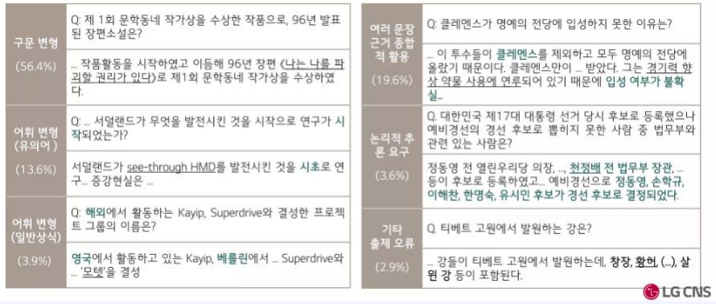

## 💡프로젝트 소개

#### 1️⃣ 주제 : 질의 응답을 위한 기계독<br>
#### 2️⃣ 설명 : [KorQuAD: 기계독해를 위한 한국어 질의응답 데이터셋](https://www.dbpia.co.kr/journal/articleDetail?nodeId=NODE07613668)을 기반으로 기계독해 모댈 구현<br> 
#### 3️⃣ 모델 : Hugging Face [monologg/koelectra-base-v3-discriminator](https://huggingface.co/monologg/koelectra-base-v3-discriminator) 모델 사용하여 진행<br><br>

## 논문 소개
- 한국어 위키백과를 기반으로 한 대규모 기계 독해 데이터셋으로 KorquAD 1.0~2.0이 있지만 여기서는 1.0 버전을 활용한다. 
<br>


### 부연설명
- 스탠포드 대학교의 SQuAD 1.0를 표방한 데이터셋
- 1,560개의 한국어 위키피디아 문서에서 10,645건의 문단과 66,181개의 질의응답 쌍
- Training set 60,407 / Dev set 5,774 질의응답 쌍으로 구


---
## 1. train

```
logdirlocation = 'LOG/KLUE'
os.makedirs(logdirlocation, exist_ok=True)

!python SRC/train.py \
  -mode train \
  -encoder transformer \
  -dropout 0.1 \
  -bert_data_path data/bert_data/train/korean \
  -model_path MODEL/KLUE/bert_transformer \
  -lr 2e-3 \
  -visible_gpus 0 \
  -gpu_ranks 0 \
  -world_size 1 \
  -report_every 1000\
  -save_checkpoint_steps 100 \
  -batch_size 1000 \
  -decay_method noam \
  -train_steps 1000 \
  -accum_count 2 \
  -log_file LOG/KLUE/bert_transformer.txt \
  -use_interval true \
  -warmup_steps 200 \
  -ff_size 2048 \
  -inter_layers 2 \
  -heads 8
```

## 2. Test
```
!python SRC/train.py \
  -mode inference \
  -visible_gpus -1 \
  -gpu_ranks -1 \
  -world_size 0 \
  -log_file LOG/KLUE/bert_transformer.txt \
  -test_from MODEL/KLUE/bert_transformer/model_step_1000.pt \
  -input_text raw_data/valid/valid_0.txt
```

---
## 🗓️ 프로젝트 개선 진행

|개선사항|이유|진행률(%)|
|:-----:|:-----:|:-----:|
|Data Augmentation|법률문서 낮은 score||
|5만 step로 학습|테스트로 1000 학습||
|Transformer로 서비스 구현|Transformer가 가장 성능이 좋음||
|RoBERTa, ELECTRA등 고려|BERT보다 좋은 성능 모델 존재||


---
